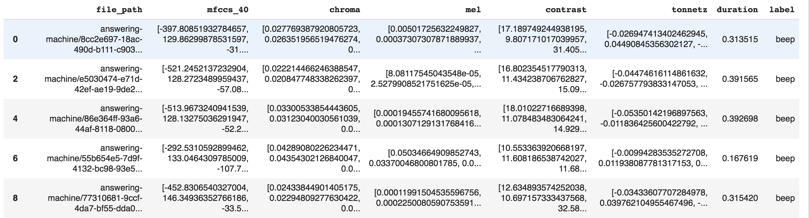
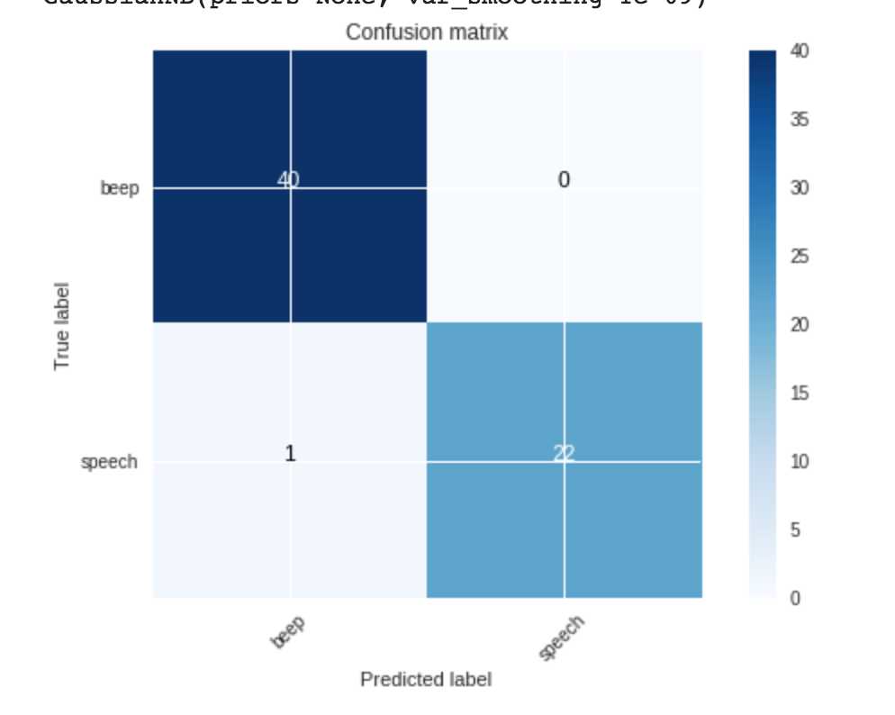

Have you ever needed to detect if an answering machine has answered your voice call? No? Thats ok - I did!

# Prerequisites
This post assumes you know some Python as well as having a very basic understanding of machine learning.

------


A few weeks ago, I received a request from our of our sales engineers about a answering machine detection service for a client. They wanted a way to send a message to a answering machine when the call went to voicemail. When the answering machine picked up, they wanted to send a canned response into the voicemail.
I've done some research on this, and it does seem possible, but I couldn't find anything on HOW this was done. So I decided to figure out..

The first thought was to build a machine learning model that is to detect when the `beep` sound in an answering machine is detected. In this post, we'll go over how we trained the model, built it, and deployed into a application.

# Training Data
Before we can start building a machine learning model, we need to have some data. For this problem, we need to have a bunch of audio files with the answering machine `beep` sound, like this:

[audio wav="https://www.nexmo.com/wp-content/uploads/2019/02/75ea624b-8ab9-4e17-9000-70e96166642a-1.wav"][/audio]

or this:
[audio wav="https://www.nexmo.com/wp-content/uploads/2019/02/75ea624b-8ab9-4e17-9000-70e96166642a.wav"][/audio]

We also need to include samples that don't include the beep:

[audio wav="https://www.nexmo.com/wp-content/uploads/2019/02/26b25bb7-6825-43e7-b8bd-03a3884ed694.wav"][/audio]
[audio wav="https://www.nexmo.com/wp-content/uploads/2019/02/5c082690-02f2-11e9-aa3d-ad1a095d8d72.wav"][/audio]

Since this kind of data doesn't seem to exist on the internet, the next step is to gather as many samples of beeps and other sounds from calls, in order to train our model. To do this, we built a [webpage](https://amd-recording-capture.herokuapp.com) that allows anyone to record their voicemail greeting message.
When you call the Nexmo number, the application will create an outbound call to the same number. When the call is received, you just need to send the call to voicemail. From there, we record the call and save the file into a Google Cloud Storage bucket.

After we have a bunch of samples, which took a week or 2 to gather, we now have some data when can look like and see if there is a difference between the beep sound, and other recordings

------


In any machine learning project, one of the first things to do (after gathering data) is to look at the data, and make sure its something we can work with.
Since its audio, we can't *look* at it directly, but we can use a way to visualize the audio files using a mel-spectrogram,


A mel-spectrogram shows a range of frequencies (lowest at the bottom of the display, highest at the top) and shows how loud events are at different frequencies. In general loud events will appear bright and quiet events will appear dark.

We'll need to load a few sounds files of both beep sounds and non-beep sounds, plot them, and see how they look. To show the mel-spectrogram, we'll use a python package called [librosa](https://librosa.github.io) to load the audio recording, then plot the melspectrogram using matplotlib, another python package

```Python
import glob
import librosa
import matplotlib.pyplot as plt
%matplotlib inline

def plot_specgram(file_path):
  y, sr = librosa.load(file_path)
  S = librosa.feature.melspectrogram(y=y, sr=sr, n_mels=128,fmax=8000)
  plt.figure(figsize=(10, 4))
  librosa.display.specshow(librosa.power_to_db(S,ref=np.max),y_axis='mel', fmax=8000,x_axis='time')
  plt.colorbar(format='%+2.0f dB')
  plt.title(file_path.split("/")[-2])
  plt.tight_layout()

sound_file_paths = ["drive/My Drive/amd-training/answering-machine/07a3d677-0fdd-4155-a804-37679c039a8e.wav",
                    "drive/My Drive/amd-training/answering-machine/26b25bb7-6825-43e7-b8bd-03a3884ed694.wav",
                    "drive/My Drive/amd-training/answering-machine/2a685eda-8dd9-4a4d-b00e-4f43715f81a4.wav",
                    "drive/My Drive/amd-training/answering-machine/55b654e5-7d9f-4132-bc98-93e576b2d665.wav",
                    "drive/My Drive/amd-training/speech-recordings/110ac98e-34fa-42e7-bbc5-450c72851db5.wav",
                    "drive/My Drive/amd-training/speech-recordings/3840b850-02e6-11e9-aa3d-ad1a095d8d72.wav",
                    "drive/My Drive/amd-training/speech-recordings/55b654e5-7d9f-4132-bc98-93e576b2d665.wav",
                    "drive/My Drive/amd-training/speech-recordings/81270a2a-088b-4e3c-9f47-fd927a90b0ab.wav"
                    ]

for file in sound_file_paths:
  plot_specgram(file)
```
Lets see what each audio file looks like.


You can clearly tell which audio file is a beep, and which is just speech. Next, we'll gather our data, and train a simple model.

------

Before we train our model, we will take all the recordings that we have, for both beeps, and non-beeps, and convert each recording into a matrix of numbers, since our model, will only accept numbers, rather than an image.
To compute the matrix, we'll use the Mel-frequency [cepstral coefficients (MFCCs)](https://en.wikipedia.org/wiki/Mel-frequency_cepstrum) of each sample. Then, we'll save this value into a [Pandas](https://pandas.pydata.org) [Dataframe](https://pandas.pydata.org/pandas-docs/version/0.21/generated/pandas.DataFrame.html), so that we can re-use later without having to re-compute the MFCC's over again.
For each audio sample, the dataframe will contain the path to the audio sample, the type of audio sample it is(beep, or non-beep), the MFCC, the duration of the audio sample (using the [`get_duration` function in librosa](https://librosa.github.io/librosa/generated/librosa.core.get_duration.html)). We also tried a few other audio characteristics including [chroma](https://librosa.github.io/librosa/generated/librosa.feature.chroma_stft.html), [contrast](https://librosa.github.io/librosa/generated/librosa.feature.spectral_contrast.html) and [tonnetz](https://librosa.github.io/librosa/generated/librosa.feature.tonnetz.html)). However, these features were not used in the latest version of the model.

Let's now take a look at the first 5 rows of the Dataframe, just to see what the data looks like.


Each row contains a 1 dimension matrix of each of the audio features. This is what we'll use to train our model.


## Training

Now we'll take this Dataframe, and train it. We'll be using Scikit learn package to do our training. [Scikit learn](https://scikit-learn.org) is a great package that allows you to build simple machine learning models without having to be a machine learning expert.

There are many types of models in scikit-learn that you can use right out of the box. A good part of our time when building out the model is to try a bunch of models on the data, and see what works best. In our research, we tried the following models and included their accuracy. Accuracy is just a percentage on how well the model did.

For each model, we took our dataframe, which contained the label of each audio file, (beep, speech), with the MFCC for each sample, split it into a train and test dataset, and ran each model through the data.

```python
def train(features, model):
  X, y = generateFeaturesLabels(features)
  X_train, X_test, y_train, y_test = train_test_split(X, y, test_size=0.33, random_state=42)

  model.fit(X_train, y_train)
  print("Score:",model.score(X_test, y_test))

  cross_val_scores = cross_val_score(model, X, y, cv=5, scoring='f1_macro')
  print("cross_val_scores:", cross_val_scores)
  print("Accuracy: %0.2f (+/- %0.2f)" % (cross_val_scores.mean(), cross_val_scores.std() * 2))

  predictions = model.predict(X_test)

  cm = metrics.confusion_matrix(y_test, predictions)
  plot_confusion_matrix(cm, class_names)

  return model
```
The function `train`, takes a list of features that we want to use, which is just MFCC of the audio sample, as well as the model we want to train on. Then, we print our score, which is how well the performed. We also print the [cross validation score](https://scikit-learn.org/stable/modules/cross_validation.html). This makes sure that our model was trained correctly. The `plot_confusion_matrix` function plots a [confusion matrix](https://www.dataschool.io/simple-guide-to-confusion-matrix-terminology/) that shows exactly what the model got correct and incorrect



We trained a few models on our data. These models, as well as their accuracy (how well the model performed) follow:

* [RandomForestClassifier](http://scikit-learn.org/stable/modules/generated/sklearn.ensemble.RandomForestClassifier.html) 97% accuracy
* [LogisticRegression](https://scikit-learn.org/stable/modules/generated/sklearn.linear_model.LogisticRegression.html) 96% accuracy
* [Support Vector Machines](https://scikit-learn.org/stable/modules/svm.html) 84% accuracy
* [Gaussian Naive Bayes](https://scikit-learn.org/stable/modules/generated/sklearn.naive_bayes.GaussianNB.html) 98%

All these models performed very well, except Support Vector Machines. The best was Gaussian Naive Bayes, so we will use that model. In our Confusion Matrix from above, out of the 67 examples, 40 samples that were predicted as a `beep`, were actually `beeps`, and 22 samples that were predicted to be `speech`, were in fact, `speech` examples. However, 1 example that was predicted to be a `beep`, was actually `speech`

After we have our model, we need to save it to a file, then import this model into our VAPI application.
```python
import pickle
filename = "model.pkl"
pickle.dump(model, open(filename, 'wb'))
```

## Building the application
The last part is to now integrate our model into a VAPI application.
[Source](https://github.com/nexmo-community/AnsweringMachineDetection/blob/master/websocket-demo.py)

We'll build an application that lets a user dial a Nexmo Number. We'll then ask the user to enter a phone number to call. Once that number is entered, we'll connect that call into the current conversation, and connect to our websocket. Using [Nexmo websockets](https://developer.nexmo.com/voice/voice-api/guides/websockets), we are able to stream the audio call into our application.

When the user first dials the Nexmo number, we return a NCCO with the following:

```python
class EnterPhoneNumberHandler(tornado.web.RequestHandler):
    @tornado.web.asynchronous
    def get(self):
        ncco = [
              {
                "action": "talk",
                "text": "Please enter a phone number to dial"
              },
              {
                "action": "input",
                "eventUrl": ["https://3c66cdfa.ngrok.io/ivr"],
                "timeOut":10,
                "maxDigits":12,
                "submitOnHash":True
              }

            ]
        self.write(json.dumps(ncco))
        self.set_header("Content-Type", 'application/json; charset="utf-8"')
        self.finish()
```

We first send a [Text-To-Speech action](https://developer.nexmo.com/voice/voice-api/guides/text-to-speech) into the call asking the user to enter a phone number. When the phone number is entered, we get those digits from the `https://3c66cdfa.ngrok.io/ivr` url.

```python
class AcceptNumberHandler(tornado.web.RequestHandler):
    @tornado.web.asynchronous
    def post(self):
        data = json.loads(self.request.body)
        print(data)
        ncco = [
              {
                "action": "talk",
                "text": "Thanks. Connecting you now"
              },
            {
                "action": "record",
                "eventUrl": ["https://3c66cdfa.ngrok.io/recording"],
              },
             {
             "action": "connect",
              "eventUrl": ["https://3c66cdfa.ngrok.io"/event"],
               "from": NEXMO_NUMBER,
               "endpoint": [
                 {
                   "type": "phone",
                   "number": data["dtmf"]
                 }
               ]
             },
              {
                 "action": "connect",
                 "eventUrl": ["https://3c66cdfa.ngrok.io/event"],
                 "from": NEXMO_NUMBER,
                 "endpoint": [
                     {
                        "type": "websocket",
                        "uri" : "ws://3c66cdfa.ngrok.io/socket",
                        "content-type": "audio/l16;rate=16000"

                     }
                 ]
               }
            ]
        self.write(json.dumps(ncco))
        self.set_header("Content-Type", 'application/json; charset="utf-8"')
        self.finish()
```

After the phone number is entered, we will receive a callback from the `https://3c66cdfa.ngrok.io/ivr` url. Here, we take the phone number the user entered from `data["dtmf"]`, and perform a [connect action](https://developer.nexmo.com/voice/voice-api/ncco-reference#connect) to that phone number, then perform another connect action into our websocket. Now, our websocket is able to listen in on the call.

As the call is streamed into the websocket, we need to capturing chunks of speech using Voice Activity Detection, save into a wave file, and make our predictions on that wav file, using our trained model.

```python
class AudioProcessor(object):
    def __init__(self, path, rate, clip_min, uuid):
        self.rate = rate
        self.bytes_per_frame = rate/25
        self._path = path
        self.clip_min_frames = clip_min // MS_PER_FRAME
        self.uuid = uuid
    def process(self, count, payload, id):
        if count > self.clip_min_frames:  # If the buffer is less than CLIP_MIN_MS, ignore it
            fn = "{}rec-{}-{}.wav".format('', id, datetime.datetime.now().strftime("%Y%m%dT%H%M%S"))
            output = wave.open(fn, 'wb')
            output.setparams((1, 2, self.rate, 0, 'NONE', 'not compressed'))
            output.writeframes(payload)
            output.close()
            debug('File written {}'.format(fn))
            self.process_file(fn)
            info('Processing {} frames for {}'.format(str(count), id))
            self.removeFile(fn)
        else:
            info('Discarding {} frames'.format(str(count)))
    def process_file(self, wav_file):
        if loaded_model != None:
            print("load file {}".format(wav_file))

            X, sample_rate = librosa.load(wav_file, res_type='kaiser_fast')
            mfccs = np.mean(librosa.feature.mfcc(y=X, sr=sample_rate, n_mfcc=40).T,axis=0)
            X = [mfccs]
            prediction = loaded_model.predict(X)
            print("prediction",prediction)

            if prediction[0] == 0:
                beep_captured = True
                print("beep detected")
            else:
                beep_captured = False

            for client in clients:
                client.write_message({"uuids":uuids, "beep_detected":beep_captured})

        else:
            print("model not loaded")
    def removeFile(self, wav_file):
         os.remove(wav_file)
```

Once we have a wav file, we use `librosa.load` to load in the file, and then use the `librosa.feature.mfcc` function to generate the MFCC of the sample. We then call `loaded_model.predict([mfccs])` to make our prediction. If the output of this function is `0`, a `beep` was detected. If it outputs `1`, then its `speech`. We then generate a JSON payload of wether a `beep` was detected, as the a uuids, of the conversation. This way, our client application, can send a TTS into the call, using the uuids.

## Websocket Client

The final step is to build a client that connects to the websocket, observes when a beep is detected, and send a TTS into the call, when the voicemail is detected.

[Source](https://github.com/nexmo-community/AnsweringMachineDetection/blob/master/websocket-client.py)

First, we need to connect to the websocket.
```python
ws = websocket.WebSocketApp("ws://3c66cdfa.ngrok.io/socket",
                              on_message = on_message,
                              on_error = on_error,
                              on_close = on_close)
ws.on_open = on_open

ws.run_forever()
```

Next, we just listen for any incoming message from our websocket.

```python
def on_message(ws, message):
    data = json.loads(message)
    if data["beep_detected"] == True:
        for id in data["uuids"]:
            response = client.send_speech(id, text='Answering Machine Detected')

        time.sleep(4)
        for id in data["uuids"]:
            try:
                client.update_call(id, action='hangup')
            except:
                pass
```

We'll parse the incoming message as JSON, then check the  `beep_detected` property is `True`. If it is, then a `beep` was detected. We will then send a TTS into the call saying 'Answering Machine Detected', then perform a [`hangup` action](https://developer.nexmo.com/api/voice#updateCall) into the call.

------

## Conclusion
We've shown how we built a answering machine detection model with 96% accuracy, with using a few audio samples of `beeps` and `speech` in order to train our model. Hopefully, we've shown how you can use machine learning in your projects. Enjoy!
